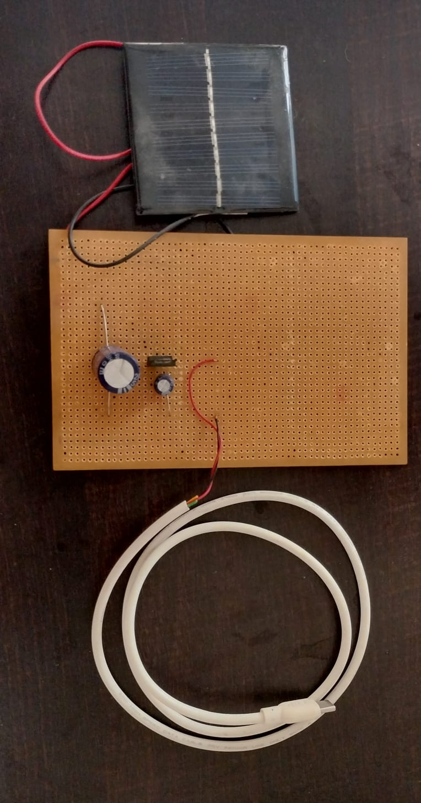
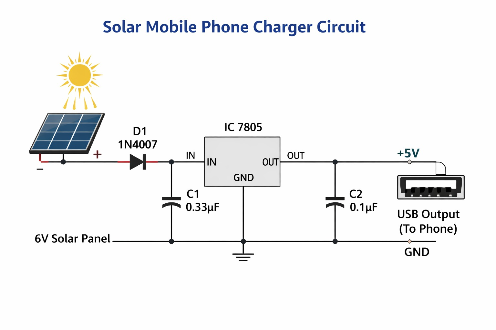

<p align="center">
  
</p>

<h1 align="center">☀️ Solar-Powered Mobile Charger</h1>

<p align="center">
A hardware-based Solar-Powered Mobile Charger that converts solar energy into a regulated 5V output for charging mobile devices. The project uses a solar panel, 7805 voltage regulator, diode, capacitors, and USB output to demonstrate an eco-friendly charging solution without using any microcontroller.
</p>

---

## 📖 Project Overview

With the increasing demand for renewable energy, solar-powered charging systems provide a clean, sustainable, and portable alternative to conventional power sources.

This project demonstrates a simple Solar-Powered Mobile Charger that converts sunlight into electrical energy using a solar panel. The generated voltage is regulated using a 7805 voltage regulator to provide a stable 5V output suitable for charging mobile devices through a USB port.

The project showcases the practical application of basic power electronics, voltage regulation, and renewable energy concepts.

---

## ✨ Features

- ☀️ Uses renewable solar energy
- 🔋 Provides regulated 5V output for mobile charging
- ⚡ Portable and eco-friendly design
- 🔌 USB output for charging compatible devices
- 🚫 No programming required
- 🤖 No microcontroller used
- 💰 Low-cost and simple hardware implementation
- 🎓 Ideal for educational and demonstration purposes

---

## 🛠 Components Used

| Component | Quantity |
|-----------|----------|
| 6V Solar Panel | 1 |
| 7805 Voltage Regulator IC | 1 |
| Diode (1N4007) | 1 |
| Capacitors | 2 |
| USB Female Connector | 1 |
| Connecting Wires | As required |
| Breadboard / PCB | 1 |

---

## ⚙️ Working Principle

The project operates by converting solar energy into electrical energy.

1. The solar panel captures sunlight and generates DC voltage.
2. The generated voltage passes through a diode, preventing reverse current flow.
3. A 7805 voltage regulator regulates the varying input voltage to a constant 5V output.
4. Capacitors are used to filter voltage fluctuations and improve output stability.
5. The regulated output is supplied to a USB connector, allowing compatible mobile devices to be charged safely.

This project demonstrates the practical implementation of renewable energy systems and voltage regulation without requiring any software or microcontroller.

---

## 📷 Project Images

### Prototype

<p align="center">
  
</p>

---

### Circuit Diagram

<p align="center">
  
</p>

---

## 📄 Documentation

📘 **Project Report:** [Solar-Powered Mobile Charger (PDF)](solar-powered-mobile-charger.pdf)

---

## 🎯 Applications

- 📱 Emergency mobile charging
- 🏕 Outdoor camping and trekking
- 🌞 Renewable energy demonstrations
- 🎓 Electronics laboratory experiments
- 🏡 Rural and remote areas with limited electricity
- 📚 Educational hardware projects

---

## ⚠️ Limitations

- Charging speed depends on sunlight intensity.
- Not suitable for charging high-power devices.
- Performance decreases during cloudy or rainy weather.
- Limited output power compared to commercial chargers.

---

## 🚀 Future Improvements

Possible enhancements include:

- Adding a rechargeable battery for energy storage
- Integrating a solar charge controller
- Using MPPT (Maximum Power Point Tracking) for higher efficiency
- Adding battery charging status indicators
- Designing a compact PCB enclosure
- Incorporating USB Type-C output
- IoT-based monitoring of charging performance

---

## 📚 Technologies Used

- Renewable Energy
- Solar Energy Systems
- Power Electronics
- Voltage Regulation
- Hardware Circuit Design

---

## 📁 Repository Contents

```text
Solar-Powered-Mobile-Charger/
│
├── README.md
├── solar-powered-mobile-charger.pdf
├── project-photo.jpeg
└── circuit-diagram.jpeg
```

---

## 👩‍💻 Author

**Vidhi Sevaramani**

B.Tech Student in Electronics Engineering

Passionate about Electronics, Robotics, Embedded Systems, IoT, Renewable Energy, and Hardware Project Development.

---

## ⭐ Support

If you found this project helpful or interesting, please consider giving this repository a **⭐ Star**.

Thank you for visiting this repository!
